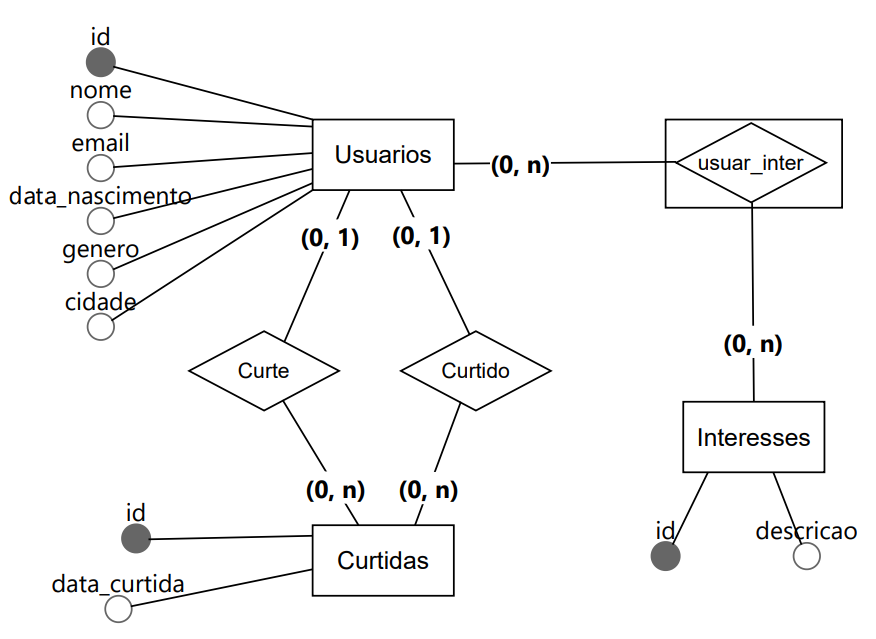

# Exercício de Banco de Dados – App de Encontros

Você foi contratado para modelar o banco de dados de um **aplicativo de encontros (namoro)**. O objetivo do sistema é permitir que usuários encontrem potenciais parceiros com base em interesses em comum e curtidas mútuas. Para isso, será necessário criar o modelo do banco, inserir dados fictícios e desenvolver consultas SQL conforme descrito abaixo.

## Requisitos do Banco de Dados

O sistema deverá conter, no mínimo, as seguintes entidades:

### 1. `usuarios`
- `id`: Identificador único
- `nome`
- `email`
- `data_nascimento`
- `genero`
- `cidade`

### 2. `interesses`
- `id`: Identificador único
- `descricao`: (Ex: “Música”, “Esportes”, “Leitura”, etc)

### 3. `curtidas`
- Representa quando um usuário curte o perfil de outro
- `id`
- `id_usuario_origem`
- `id_usuario_destino`
- `data_curtida`

### 4. `usuarios_interesses`
- Relacionamento N:N entre usuários e interesses
- `id_usuario`
- `id_interesse`


## Tarefas

### 1. Modelagem Conceitual
- Elabore o **Diagrama Entidade-Relacionamento (DER)** com:
  - Entidades
  - Atributos
  - Relacionamentos
  - Cardinalidades
  - Chaves primárias e estrangeiras




### 2. Criação das Tabelas (DDL)
- Escreva os comandos SQL para criação das tabelas mencionadas.
- Inclua as restrições adequadas:
  - Chaves primárias
  - Chaves estrangeiras
  - Tipos de dados

```sql

CREATE TABLE usuarios (
    id SERIAL PRIMARY KEY,
    nome VARCHAR(100) NOT NULL, 
    email VARCHAR(100) NOT NULL UNIQUE, 
    data_nascimento DATE NOT NULL, 
    genero VARCHAR(1) NOT NULL CHECK (genero IN ('M', 'F')), 
    cidade VARCHAR(100) NOT NULL
);

CREATE TABLE curtidas (
    id SERIAL PRIMARY KEY,
    id_usuario_origem INTEGER REFERENCES usuarios(id) ON DELETE CASCADE,
    id_usuario_destino INTEGER REFERENCES usuarios(id) ON DELETE CASCADE,
    data_curtida TIMESTAMP NOT NULL DEFAULT CURRENT_TIMESTAMP,
    UNIQUE(id_usuario_origem, id_usuario_destino)
);

CREATE TABLE interesses (
    id SERIAL PRIMARY KEY,
    descricao VARCHAR(100) NOT NULL
);

CREATE TABLE usuarios_interesses(
    id_usuario INTEGER REFERENCES usuarios(id) ON DELETE CASCADE,
    id_interesse INTEGER REFERENCES interesses(id) ON DELETE CASCADE,
    PRIMARY KEY(id_usuario, id_interesse)
);

```

### 3. Inserção de Dados (DML)
- Insira pelo menos:
  - 5 usuários
  - 4 interesses
  - Associe os usuários a 2 ou mais interesses cada
  - Registre pelo menos 6 curtidas entre os usuários

```sql

INSERT INTO usuarios (nome, email, data_nascimento, genero, cidade) VALUES
('Alice Silva', 'alice@example.com', '1995-05-12', 'F', 'São Paulo'),
('Bruno Costa', 'bruno@example.com', '1992-08-30', 'M', 'Rio de Janeiro'),
('Carla Mendes', 'carla@example.com', '1990-12-22', 'F', 'Belo Horizonte'),
('Daniel Rocha', 'daniel@example.com', '1988-03-17', 'M', 'Curitiba'),
('Eduarda Lima', 'eduarda@example.com', '1997-07-05', 'F', 'Porto Alegre');

INSERT INTO interesses (descricao) VALUES
('Esportes'),
('Tecnologia'),
('Música'),
('Cinema');


-- Alice
INSERT INTO usuarios_interesses (id_usuario, id_interesse) VALUES
(1, 1), -- Esportes
(1, 3); -- Música

-- Bruno
INSERT INTO usuarios_interesses (id_usuario, id_interesse) VALUES
(2, 2), -- Tecnologia
(2, 4); -- Cinema

-- Carla
INSERT INTO usuarios_interesses (id_usuario, id_interesse) VALUES
(3, 1), -- Esportes
(3, 2), -- Tecnologia
(3, 4); -- Cinema

-- Daniel
INSERT INTO usuarios_interesses (id_usuario, id_interesse) VALUES
(4, 3), -- Música
(4, 4); -- Cinema

-- Eduarda
INSERT INTO usuarios_interesses (id_usuario, id_interesse) VALUES
(5, 1), -- Esportes
(5, 2), -- Tecnologia
(5, 3); -- Música


INSERT INTO curtidas (id_usuario_origem, id_usuario_destino) VALUES
(1, 2), -- Alice curtiu Bruno
(1, 3), -- Alice curtiu Carla
(2, 5), -- Bruno curtiu Eduarda
(3, 1), -- Carla curtiu Alice
(4, 3), -- Daniel curtiu Carla
(5, 4); -- Eduarda curtiu Daniel


```

### 4. Consultas SQL

Realize as seguintes consultas utilizando os comandos indicados:

- a) Liste o nome de cada usuário e seus interesses  
  **→ Utilize `INNER JOIN`**

```sql

SELECT u.nome AS usuario, i.descricao AS interesse
FROM usuarios u
INNER JOIN usuarios_interesses ui ON u.id = ui.id_usuario
INNER JOIN interesses i ON i.id = ui.id_interesse
ORDER BY u.nome;

```

- b) Liste todos os usuários e seus interesses, mesmo que não tenham interesses cadastrados  
  **→ Utilize `LEFT JOIN`**

```sql

SELECT u.nome AS usuario, i.descricao AS interesse
FROM usuarios u
LEFT JOIN usuarios_interesses ui ON u.id = ui.id_usuario
LEFT JOIN interesses i ON i.id = ui.id_interesse
ORDER BY u.nome;

```

- c) Liste os pares de curtidas recíprocas (usuário A curtiu B e B também curtiu A), exibindo os nomes dos dois envolvidos

```sql

SELECT u1.nome AS usuario_a, u2.nome AS usuario_b
FROM curtidas c1
JOIN curtidas c2 
  ON c1.id_usuario_origem = c2.id_usuario_destino 
  AND c1.id_usuario_destino = c2.id_usuario_origem
JOIN usuarios u1 ON u1.id = c1.id_usuario_origem
JOIN usuarios u2 ON u2.id = c1.id_usuario_destino;

```

- d) Mostre a quantidade de curtidas recebidas por cada usuário, ordenadas da maior para a menor  
  **→ Utilize `GROUP BY`**

```sql

SELECT u.nome, COUNT(c.id) AS curtidas_recebidas
FROM usuarios u
LEFT JOIN curtidas c ON u.id = c.id_usuario_destino
GROUP BY u.nome
ORDER BY curtidas_recebidas DESC;

```

- e) Liste as cidades com maior número de usuários cadastrados  
  **→ Utilize `GROUP BY` e `COUNT`**

```sql

SELECT cidade, COUNT(*) AS total_usuarios
FROM usuarios
GROUP BY cidade
ORDER BY total_usuarios DESC;

```


## Entrega esperada

Envie um repositório ou pacote contendo os seguintes arquivos:

- Arquivo com o **DER** (imagem ou PDF)
- Script `.sql` com:
  - Comandos DDL (criação das tabelas)
  - Comandos DML (inserção de dados)
  - Consultas SQL solicitadas
